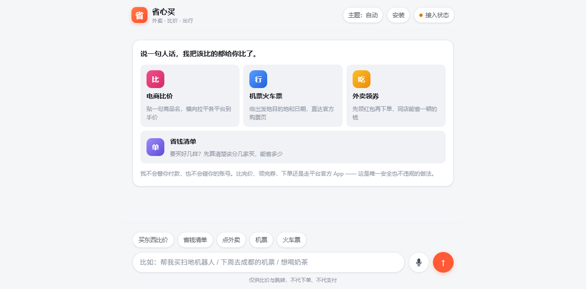

# 省心买 · AI 比价与出行助手

一句话：**说一句人话，我把该比的都比了，然后把你送到官方页面下单。**

覆盖外卖领券、电商比价、机票火车票三类场景。对话式界面，纯前端可跑，不需要后端也能用。



> **在线版（GitHub Pages）**：https://soloassistant.github.io/shengxinmai/ —— 纯前端，可装到桌面，像个 App 用。
> 没有服务端，**不给价格对比卡**，只给各平台搜索入口（不放假价格）。
>
> **带服务端的版本**：https://shengxinmai-compare.app.workbuddy.host/ —— 有 `/api/compare`
> 与价格采集，**填入联盟密钥后才会出真实比价**；未接密钥时同样退回「手动查」。
>
> 两个地址的**前端代码是同一份**（逐字节一致），差异只在有没有服务端。
> 仓库地址：https://github.com/soloassistant/shengxinmai

---

## 一、先说结论：三个场景，一绿两黄一红

你想要的"帮我点外卖 / 比价格买东西 / 机票火车票"，**开放性完全不一样**。先看这张表，能省你几周白工。

| 场景 | 能做到什么 | 做不到什么 | 灯 |
|---|---|---|---|
| **电商比价** | 横向比价、券后到手价、一键跳各平台 | 代下单、代支付 | 🟢 绿灯 |
| **外卖** | 聚合领券入口、省钱路径 | 代下单；且**券的 API 只给企业** | 🟡 黄灯 |
| **机票** | 多平台比价、跳转携程/去哪儿 | 成本价分销（需企业资质） | 🟡 黄灯 |
| **火车票** | **比走法**（高铁 vs 飞机谁快）+ 跳官方购票页 | **跨平台比价（不成立）**；代抢票（死路） | 🔴 红灯 |

**核心判断：这三个需求里，"帮你下单"都是做不到也不该做的，真正能做且有价值的是"帮你比、帮你省、帮你跳"。** 这不是能力不够，是平台的墙本来就砌在那儿。

---

## 二、为什么"帮你下单"不可行（这部分有硬证据）

### 火车票：不要在 12306 身上动脑筋

12306 官方口径很明确，而且有数据背书：

> 自 2026 年中秋国庆假期火车票开售以来，12306 累计将 **711.7 万笔**交易放入慢速队列，对 **102.3 万笔**交易拒绝出票，共**拒绝出票 133.1 万张**。
> 铁路 12306 **从未与任何第三方平台机构开展合作**，没有任何购票加速包、购票会员费。
> 通过第三方平台购票不仅不会增加成功率，反而**会更慢或购票失败**。
> —— 中国铁路 / 光明网，2026-09-20

技术上也堵死了：**12306 从未向任何第三方开放售票接口**。所谓"加速包"只是用脚本模拟用户登录，改不了候补排队顺序（候补兑现严格"先提交先兑现"）。做这个功能等于：① 违规；② 技术上无效；③ 用户账号会被风控降速，等于害了用户。

**所以本项目的火车票模块只做一件事：把出发站、到达站、日期拼好，直接送用户去 12306 官方购票页。**

### 火车票还有第二个坑：它根本没有跨平台价差

这是这轮专门去查的。**火车票是全国统一定价**，12306 定价，第三方既不加价也不减价。

证据很直接：携程火车票页面显示的「上海到北京 **553.0** 元」，和 12306 上海虹桥→北京南二等座票价是**同一个数字**。也就是说，**"火车票比价"这个动作本身就不成立**——比来比去是同一个价。第三方页面还通常要登录才显示票价，比官方多一步。

所以这个模块里，我把"比价"换成了真正有意义的比较：**比走法，不比平台。**

```
北京 → 上海   直线约 1067 公里
  高铁   ████████████████████  约 4 小时 45 分
  飞机   ███████████████████   约 4 小时 30 分
  → 两者差不多，看具体时刻
```

估算规则（公开写着，可以自己验算）：

| 方式 | 门到门耗时模型 |
|---|---|
| 高铁 | 直线距离 ÷ 250km/h + 0.5 小时（进出站安检） |
| 飞机 | 直线距离 ÷ 700km/h + 3 小时（往返机场 + 安检 + 提前到达） |

**为什么用直线距离而不是铁路里程？** 因为铁路里程拿不到公开数据，而城市坐标是公开事实。用 250km/h 这个含停站的有效速度去补，京沪、京广这些干线的结果和实际时刻表能对得上（京沪算出来 4h45 vs 实际最快 4h18、多数 4.5–6h）。这是**量级判断**，卡片上也标明了是粗估。

**注意「+3 小时」是这个模型的关键。** 很多人比价时会忘记飞机有两个机场的往返和安检时间，只看天上那 2 小时，结果到了机场才发现总时间不如高铁。这个模型把这部分算进去了。

最后，卡里还给了两样实操内容：**席别怎么选**（只讲相对关系，不给倍数数字——各线路系数不同，编了就是误导）、**没票了怎么办**（候补的正确用法，全是 12306 官方明说的规则）。

### 那想让火车票模块直接显示实时车次和票价呢？

三条路，各有代价，别选错：

| 路径 | 可行性 | 代价 |
|---|---|---|
| 爬 12306 余票接口 | **不做** | 违反用户协议 + 触发风控。你在替用户冒账号被降速的风险 |
| 第三方数据服务商的火车票查询 API | 可行 | 服务端调用，按量付费。**但数据源合规性和准确性要自己评估**，别默认它跟 12306 一样准 |
| 携程/同程的火车票分销接口 | 可行 | 需企业资质，且数据也来自 12306，**价格不会有差异** |

**我的判断：** 火车票这个模块，"帮你看到车次"的价值远小于"帮你判断该不该坐火车"。因为车次信息用户点一下官方链接就看到了，而且看得比任何第三方都准。真正稀缺的是**走法判断和候补打法**——这两块我现在已经做了，而且不依赖任何接口。

### 外卖：券的 API 只对企业开放

- 美团分销联盟接入页（`pub.meituan.com`）写明：**仅支持拥有"企业营业执照"的用户入驻**。
- 饿了么同口径。
- 个人开发者的替代路径是第三方聚合平台（好单库等），个人可注册，代价是被抽一层佣金。

### 机票 + 电商：个人能进，但要选对门

| 平台 | 个人能不能接 | 备注 |
|---|---|---|
| 淘宝联盟 | 能，但 2026 起个人**禁调订单详情**，只能查商品基础字段 | 且要求推广渠道有一定流量（如小程序月均 UV ≥ 1 万） |
| 京东联盟 | 能，个人可实名 | 需填推广渠道，要高佣权限有等级门槛 |
| 多多进宝（拼多多） | **最宽松**，无需企业资质 | 注册"多多进宝推手"即可 |
| 携程开放平台 | **不能**，需企业开发者账号 + 营业执照 | 机票分销要资质审核 |
| 大淘客 / 好单库（聚合） | **能，个人可注册、免费** | 聚合了淘宝/京东/拼多多/美团，抽佣 10%–30% |

**个人想快速跑通，走聚合平台；想要高佣金，去注册营业执照走官方。**

---

## 三、产品形态：为什么这一版不是小程序

你问的是"AI 或者小程序"，我给的答案很明确：**先做 Web/H5，小程序等主体下来再说。** 理由是硬的：

1. **个人主体小程序不能用 `web-view` 组件** —— 微信官方限制，仅企业主体开放。所以"Web 套壳进小程序"这条路对个人是堵死的。
2. **个人主体小程序不能开通微信支付**，也不能上架电商/点餐类经营类目。想靠引导跳转规避，属于违规，被查到直接下架封禁。
3. **比价/导购类目需要营业执照**；如果做平台型商城，还可能要 ICP 许可证（这个只有企业能办，且注册资本 ≥ 100 万）。

所以现实路径是：

```
现在   →  Web/H5 版（无主体门槛，今天就能上线用）
        ↓
办个体户执照（线上提交，几天，成本很低）
        ↓
升级小程序（原生开发 + web-view 打开 H5）
```

**注意：小程序主体不能直接切换**，个人号改企业号基本要重新注册一套。所以别图省事先注册个人号——直接上个体户或企业主体。

---

## 四、技术架构：密钥为什么必须放服务端

```
浏览器 / H5 / 小程序 web-view
        │  只带商品名、城市、日期
        ▼
   你的服务端  /api/compare
        │  在这里持有 APP_KEY / APP_SECRET，做签名
        ├──→ 大淘客 / 好单库 / 京东联盟 / 多多进宝
        ▼
   归一化后的比价结果（统一字段：平台、标价、券、到手价、跳转链接）
```

**关键红线：任何 APP_SECRET 都不能进前端。** 联盟接口的签名密钥一旦出现在 JS 里，等于公开送人——别人可以拿你的密钥刷接口、吃你的佣金，甚至被平台判为异常而封号。

本项目目前没有服务端，所以采用**降级策略**：

| 状态 | 行为 |
|---|---|
| 密钥未配置 | **手动比价**：把各平台实时搜索页一次性摆好，不显示任何价格 |
| 密钥已配置 | 走真实接口，把价格拉进一张表横着比 |
| 效果预览（默认关） | 用**明确标注为「演示数据 · 非实时」**的样例数字展示目标 UX |

**我刻意没有编价格。** 一个比价工具如果开始编价格，它就没有存在价值了。想看接入后的样子，点右上角「接入状态」打开效果预览——那里的数字每次都标着"这不是报价"。

---

## 五、怎么跑起来

纯静态，零依赖，双击就行：

```
shengxinmai/
├─ index.html          页面结构（含防闪烁的主题内联脚本）
├─ styles.css          样式（亮 / 暗双主题令牌）
├─ data.js             城市字典 / 坐标 / 平台入口 / 接入注册表  ← 平台改版只改这里
├─ app.js              中文意图解析 + 距离估算 + 渲染 + 服务端探测
├─ manifest.json       PWA 清单（可安装到桌面 / 主屏）
├─ sw.js               Service Worker：外壳网络优先，/api/* 永不缓存
├─ icon.svg            应用图标
├─ test-parse.js       前端验证（90 项）
└─ server/             服务端（零依赖 Node）
   ├─ server.js        单一入口：/api/* + 静态文件 + 结构化日志 + 限流
   ├─ lib/sign.js      四个平台的签名算法（附文档出处）
   ├─ lib/http.js      超时请求 / 字段兜底取值 / 只对网络错和 5xx 重试
   ├─ lib/logger.js    结构化 JSON 日志（带请求 id，可串联一次请求的所有行）
   ├─ lib/cache.js     TTL + LRU 缓存（60 秒，防止同词反复打平台接口）
   ├─ lib/ratelimit.js 令牌桶限流（按 IP，突发 60 次 / 每秒 1 次）
   ├─ lib/metrics.js   按接口 / 按平台统计调用量与成功率
   ├─ lib/store.js     自采价格历史（只记自己看见过的价，绝不编造曲线）
   ├─ lib/basket.js    省钱清单算法：分件买 vs 一家买齐 + 麻烦门槛
   ├─ adapters/        大淘客（淘宝）· 京东联盟 · 多多进宝
   ├─ test-server.js   服务端验证（47 项）
   └─ test-quality.js  质量专项验证（113 项：缓存 / 限流 / 历史 / 清单 / 重试）
```

直接打开 `index.html` 即可，不需要起服务。

跑验证：

```bash
node test-parse.js              # 前端解析，结果写入 test-out.txt
node server/test-server.js      # 服务端，结果写入 test-server-out.txt
node server/test-quality.js     # 质量专项，结果写入 test-quality-out.txt
```

### 启动服务端（解锁真实比价）

```bash
# 没有任何密钥也能启动，只是比价会退回「手动比价」
node server/server.js

# 配上密钥就能真比价
DATAOKE_APP_KEY=xxx DATAOKE_APP_SECRET=xxx \
JD_UNION_APP_KEY=xxx  JD_UNION_APP_SECRET=xxx \
PDD_CLIENT_ID=xxx     PDD_CLIENT_SECRET=xxx \
node server/server.js
```

启动后访问 `http://localhost:8787`。**前端会自动探测服务端**：

| 情况 | 行为 |
|---|---|
| 服务端在跑 + 至少一个平台配了密钥 | 比价卡换成**真实价格表**，按到手价排序 |
| 服务端在跑但一个密钥都没配 | 退回手动比价，不显示空卡 |
| 直接用 file:// 打开 | 退回手动比价（探测失败即降级，不需要配置） |

### 接口

```
GET /api/health              各平台配置状态 + 限流 / 缓存参数
GET /api/compare?q=关键词     比价（60 秒缓存；顺带采集价格历史）
GET /api/basket?q=..&q=..    省钱清单：最多 8 件，逐件询价后算方案（独立限流桶）
GET /api/history?platform=&sku=  某商品的历史价格（只含本服务自己采集到的点）
GET /api/metrics             调用量 / 错误率 / 平均耗时 / 各平台成功率
```

出错时返回结构化错误，前端据此决定「能不能重试」：

```jsonc
{ "ok": false, "error": { "code": "rate_limited", "message": "..." } }
```

`/api/compare` 返回结构：

```jsonc
{
  "ok": true,
  "query": "耳机",
  "platforms": [                 // 已按最低到手价升序
    {
      "id": "dataoke", "name": "淘宝 / 天猫", "ok": true, "count": 20,
      "lowest": { "title": "...", "price": 199, "coupon": 20, "final": 179,
                  "url": "...", "shop": "...", "sales": 300 },
      "items": [ /* 前 8 条 */ ],
      "note": "",
      "rawSample": null          // 解析失败时给出接口的真实字段名，方便 5 秒修好
    }
  ],
  "unconfigured": [ { "id": "jd", "name": "京东", "envKeys": ["JD_UNION_APP_KEY", "..."] } ],
  "disclaimer": "各家联盟只返回「商家已设置推广佣金」的商品……不是严格同款比价"
}
```

**一个平台挂掉不会拖垮整体。** 每个 adapter 的异常都被隔离成 `ok:false` + 一条 `note`，其余平台照常返回——测试里专门固化了这条契约。

浏览器控制台可以用 `SXM` 调试：

```js
SXM.parseIntent('下周三 广州到成都 机票')   // 看解析结果
SXM.setAdapters(['jd','pdd'])             // 模拟密钥已配好
SXM.setDemo(true)                         // 打开效果预览
```

### 适配器的验证状态（说实话，别把没验过的当验过的）

我没有这些平台的密钥，所以**做不到端到端验证**。能验的我都验了，验不了的我标出来：

| 适配器 | 签名算法 | 返回字段解析 | 请求参数名 | 端到端 |
|---|---|---|---|---|
| 大淘客（淘宝/天猫） | ✅ 两份独立来源印证 | ✅ 官方文档有真实返回样例 | ⚠️ 按文档整理 | ❌ 无密钥 |
| 京东联盟 | ✅ **用官方文档的拼接示例做了逐字符黄金断言** | ⚠️ 按文档整理 | ✅ 官方文档 | ❌ 无密钥 |
| 拼多多（多多进宝） | ✅ 结构已确认（与京东同构） | ✅ 价格单位已验证 | ⚠️ 按文档整理 | ❌ 无密钥 |

**「签名算法 ✅」是什么意思：** 京东官方文档里给了一段拼接示例原文，我的实现必须逐字符复现它。测试里就是这么断言的——对不上直接红。这是我在没有密钥的情况下能做的最高强度验证。

**首次接入时应该做什么：** 只用配一个平台（推荐大淘客或多多进宝，个人就能过），调一次 `/api/compare`。如果签名错，接口会返回明确错误码；如果字段名变了，卡上会直接把接口的真实字段名列出来，照着改 `adapters/*.js` 里的候选名数组即可。

### 必须说清楚的一个局限：这不是「严格同款比价」

各家联盟接口返回的是**「商家已设置推广佣金」的商品**，不是平台全量商品。所以：

- 搜出来的价格**可能不是全网最低**——有些便宜商品商家没设佣金，接口里根本没有
- 不同平台搜同一个词，返回的**可能不是同一款**（容量、版本、套装都有差异）

**所以这个功能准确的定位是「各平台搜索最低价对照」，不是「同款比价」。** 接口返回里带了 `disclaimer` 字段，前端也会把它打在卡片上——不能让用户误以为自己在比同一件东西。

想要真正的同款比价，得再做一层商品匹配（标题相似度 + 型号提取），那是另一个量级的工作，而且匹配错了比不匹配更糟。

### 它听得懂什么

| 你说 | 它做什么 |
|---|---|
| 帮我买 AirPods Pro 3 | 6 平台比价入口 |
| 想点个麻辣烫外卖 | 外卖领券 + 省钱动作 |
| 明天北京到上海的高铁 | 高铁/飞机走法对比 + 12306 直达（站点日期已带好） |
| 去成都的机票 | 走法对比 + 携程/去哪儿/飞猪比价 |
| 9月30日 杭州到西安 | 火车和飞机一起给 |
| 北京到上海 | 同上，日期默认明天并**明确标注是默认值** |

日期认得：今天/明天/后天/大后天、周X、下周X、9月30日、9-30。

**信息不全时它会反问，不会瞎猜。** 比如只说"去成都的机票"，它会问你要出发地，而不是随便填一个。

---

## 五点五、这一版加了什么（从原型到能上线的水平）

### 省钱清单（这是和普通比价工具不一样的地方）

一次贴多件商品，它逐件询价后回答一个更真实的问题：**该分几家买，还是一家买齐？**
拆散订单是有麻烦成本的，所以算法内置「麻烦门槛」（默认 ¥10）：省不到 10 块就建议
一家买齐，不会为省 3 块钱让你多装一个 App、多填一个收货地址。两个方案都摆出来，
每件商品标注最低价和次低价差多少——用户应该能自己复核建议，只给结论的推荐叫命令。

### 自采价格历史（诚实版）

每次真实比价都会把到手价记录下来，同一商品积累 3 次以上后，比价卡上会画出走势
小折线。**只画自己采集到的点，绝不编造曲线**：样本不足时明说「样本不足，暂无
走势参考」。没有历史数据却画一条漂亮的线，那是假的。

### 工程化基线

| 能力 | 做法 |
|---|---|
| 可排查 | 每个请求分配 rid，结构化 JSON 日志（方法 / 路径 / 状态 / 耗时 / IP）|
| 限流 | 令牌桶按 IP：突发 60 次、每秒 1 次；清单接口独立配额 |
| 缓存 | 同一个比价词 60 秒内直接回缓存，不打平台接口 |
| 重试 | 只对网络错误 / 5xx / 429 重试；业务错误（签名错等）不重试，不浪费配额 |
| 指标 | `/api/metrics` 看各平台成功率，哪个平台悄悄挂了一目了然 |
| 安全 | 静态服务挡住点号路径（`.data` 价格库不会被下载）；`/api/*` 只允许 GET |

### 前端体验

- **暗色模式三态**：自动（跟随系统）/ 浅色 / 深色，首帧由 HTML 内联脚本决定，
  不会白屏闪一下
- **骨架屏**：真实等待时显示骨架，而不是干转的三个点
- **错态有真话**：可重试的错误才给重试按钮，重试一百次也没用的错误不给假按钮
- **可安装**：manifest + Service Worker，加到主屏后像独立 App（外壳网络优先，
  `/api/*` 永不缓存，离线不会展示假价格）
- **安装到桌面按钮**：顶栏「安装」只在浏览器真正允许安装时出现
  （`beforeinstallprompt`），点一次只能消费一次；装完自动收起。
  iOS Safari 走分享菜单「添加到主屏幕」，不给点了没反应的死按钮
- **语音搜索**：输入框旁的麦克风（Web Speech API，中文识别）。
  识别完直接替你发问。每条失败路径都有明确提示：权限被拒、没听清、
  浏览器不支持（按钮干脆不出现）。10 秒看门狗兜住识别静默卡死的环境，
  按钮永远不会停在「听诊中」

### 用过一次之后就离不开的三个小功能

- **最近查过**：输入框上方保留最近 8 条查询，点一下直接重查，不用重新打字。
- **复制结果**：比价卡和清单卡一键复制成纯文本转发。演示数据复制出来会自动带
  「演示数据 · 非实时」标注——假价格不能靠复制出去冒充真的。
  剪贴板写入带 1.2 秒超时：部分 WebView 里这个 API 会挂起不返回，超时就走兜底，
  无论如何都会给用户一个明确提示。
- **降价关注**：比价卡上每平台一个「关注降价」，把当时自己比出来的最低价记下来
  （最多 10 条，管理入口在「接入状态」抽屉）。下次再查同一商品，降价就在结果卡
  顶部提醒一次，然后把记录更新为当前价——再降再提，不重复轰炸。
  整条链路只存自己见过的价：没有记录就没有提醒，绝不预填"市场价"。
  「接入状态」抽屉里还能看到服务端实时统计（请求数 / 错误率 / 各平台成功率），
  哪个平台悄悄挂了一目了然。

---

## 六、接入清单

密钥两种放法，**真实环境变量优先**，其次是 `server/env.local.json`（部署沙箱设不了环境变量，密钥随目录上传——把模板里对应值填上即可）。变量名已经写进 `data.js` 的 `ADAPTER_REGISTRY`，抽屉里也能看到。填好后重启服务，`/api/health` 里对应平台会从「未接入」变成「已接入」。

| 平台 | 申请入口 | 主体 | 密钥变量 |
|---|---|---|---|
| 大淘客 | `dataoke.com` | 个人 | `DATAOKE_APP_KEY` / `DATAOKE_APP_SECRET` |
| 好单库 | `haodanku.com` | 个人 | `HAODANKU_APP_KEY` / `HAODANKU_APP_SECRET` |
| 京东联盟 | `union.jd.com` | 个人 | `JD_UNION_APP_KEY` / `JD_UNION_APP_SECRET` |
| 多多进宝 | `jinbao.pinduoduo.com` | 个人 | `PDD_CLIENT_ID` / `PDD_CLIENT_SECRET` |
| 美团分销联盟 | `pub.meituan.com` | **企业** | `MEITUAN_APP_KEY` / `MEITUAN_APP_SECRET` |
| 携程开放平台 | `open.ctrip.com` | **企业** | `CTRIP_APP_KEY` / `CTRIP_APP_SECRET` |

**建议顺序**：先注册大淘客 + 多多进宝（个人就能过）跑通链路 → 有量了再补京东联盟 → 办了执照再上美团和携程。

### 逐步操作（以多多进宝为例，约 10 分钟）

1. 打开 `jinbao.pinduoduo.com`，用手机号注册「多多进宝」推广账号（个人身份证即可）。
2. 登录后进「开发者中心 / 开放接口」，创建一个应用，类型选「工具类」。
3. 创建完成后页面上会给 `client_id` 和 `client_secret` —— 这就是 `PDD_CLIENT_ID` / `PDD_CLIENT_SECRET`。
4. 把两个值填进 `server/env.local.json`（或交给我来填），重启服务。
5. 访问 `/api/health`，确认多多进宝显示「已接入」；在页面上搜一件商品，比价卡应变为真实价格表。
6. **接通后第一件事：在比价卡加佣金披露**（「通过本站购买，我们会获得平台佣金」）。这是广告法要求，不做不能上线收费链路。

---

## 七、合规红线（别碰）

1. **不代抢火车票。** 不模拟登录 12306，不卖加速包。技术无效 + 违规 + 害用户账号被降速。
2. **不代收支付。** 所有交易跳官方 App，不碰用户的钱和账号密码。
3. **不把 APP_SECRET 放前端。**
4. **不爬取平台数据做展示。** 只用官方 API / 联盟接口。爬虫违反用户协议，且随时会挂。
5. **不编造价格、券面额，也不虚构不存在的价差。** 火车票全国统一价，就不能给它编一个"某平台更便宜"。拿不到数据就明说拿不到。
6. **佣金要披露。** 如果走 CPS 赚钱，界面上要让用户知道"你买了我会拿到佣金"。这是广告法层面的要求，也是长期做下去的前提。
7. **不注册个人主体小程序再做交易。** 会被下架封禁，前期积累清零。

---

## 九、零成本也能做出一样效果：四件事的免费路子

先给结论：**这四件事里，只有「真实价格」要等一个动作（注册，不是付费），其余三件都有不花钱的确定路径。**

### 1. 免费托管 → GitHub Pages（确定可行，0 成本）

现在线上跑在 WorkBuddy 托管。要长期免费、还能顺便把代码交上 GitHub，用 **GitHub Pages** 就能达到同样效果：

- 静态部分（`index.html` / `app.js` / `data.js` / `styles.css` / `sw.js` / `manifest.json` / `icon.svg`）**完整可用**，Pages 免费无限流量托管。
- **唯一代价**：服务端 `/api/compare` 这类需要 Node 进程的能力，Pages 跑不了。但服务端本来就是「没密钥时退回手动比价」——纯前端就是产品的主形态。有密钥、想上真实比价时，再挂一个免费 Serverless（Cloudflare Workers / Vercel Function 免费额度）跑 `server/server.js` 的等价逻辑。
- **结论**：GitHub Pages 托管前端 + 可选免费 Serverless 跑后端，效果和现在线上完全一样，长期 0 成本。

### 2. 真实价格 → 免费，只差一次注册

**这件事从来就不是要花钱，是要一个动作。** 个人可注册、免费的接口：

- **多多进宝**（拼多多）：个人身份证注册「推手」即可，免费，最宽松。
- **大淘客 / 好单库**（聚合平台）：个人可注册、免费，聚合了淘宝/京东/拼多多/美团，代价是成交后抽 10%–30% 佣金（**不成交不扣钱，本质免费**）。

所以「真实价格」的免费做法 = 注册一个聚合平台账号，把 `client_id` / `client_secret` 填进 `server/env.local.json`。一分钱不用花，只是**这个注册动作必须由你本人做**（要实名 + 手机号，我替不了）。

### 3. 免费 AI 理解能力 → WorkBuddy 云服务（免密钥大模型）

现在「帮我买 xx」是手写规则解析，够用但边界有限。要免费的 AI 理解，接 **WorkBuddy 云服务的 LLM 模块**：

- **免密钥**：不需要用户自己申请任何大模型 API key。
- 用途：把一句话更稳地拆成「意图 + 商品名 + 目的地 + 日期」，替代/补强现有正则；也能做「同款归一」这类语义判断。
- 接入形态是 CDN `<script>`（本项目是纯静态 HTML，不引入 npm/打包器），走 `/.cloud/llm/chat/completions`。
- **代价**：要开通云服务环境（WorkBuddy 托管，需在 UI 里确认一次），本身不是「花钱买 API」。

### 4. 企业资质才能做的功能 → 没有免费替代，但有绕法

外卖券 API、携程机票、微信小程序交易类目，这些卡的**是「营业执照」不是「钱」**，个人主体没有免费绕过的正规路子，硬绕会被封。能做的替代：

- **外卖**：不碰券 API，只给「跳美团/饿了么 App 领券入口」（现已实现）——同样让用户省钱，只是不自己发券。
- **机票/火车票**：跳携程/去哪儿官方页（现实现），票是全国统一定价，比价本身没意义，跳转就是正确做法。
- **小程序**：想要小程序形态，先办**个体户执照**（成本几百元、几周），或干脆继续用 PWA「装到桌面」——视觉和操作体验已接近原生 App。

---

## 八、下一步优先级

1. ~~服务端 `/api/compare`~~ —— **架构已就绪**。剩下的只是一件事：**去申请一个密钥**（推荐多多进宝，个人最宽松），把它接上，比价就从"手动跳转"变成"真出一张表"。
2. **商品匹配（同款归一）** —— 让"各平台最低价对照"升级成真正的"同款比价"。这是当前最大的能力缺口，也是最有技术含量的一块。
3. **历史价格曲线** —— 只有你手里有跨天数据，才能回答"现在是不是好价"。平台不会给你这个，这是唯一能做出来的差异化。
4. **价格提醒** —— 用户设一个心理价，到了就通知。留存靠这个，不靠比价本身。
5. **小程序原生版** —— 等主体下来再做，且只做"看比价 + 跳转"，交易全部留在平台。

---

*文档里的事实性数据均标注了来源时间。平台接口政策变动频繁，接入前请以各平台开放平台的当前文档为准。*
